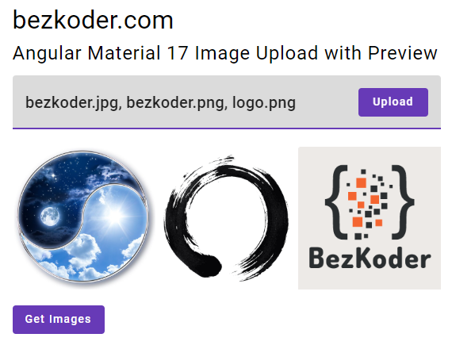

# Angular Material 17 Image upload with Preview example

In this tutorial, I will show you way to build Multiple Images upload with Preview example using Angular Material 17 and FormData with Progress Bars.

For more detail, please visit:
> [Angular Material 17 Image upload with Preview example](https://www.bezkoder.com/angular-material-17-image-upload-preview/)

## Run
Run `ng serve --port 8081` for a dev server. Navigate to `http://localhost:8081/`. The app will automatically reload if you change any of the source files.

Rest APIs server for this Angular Client:
> [Node.js Express File Upload Rest API example](https://www.bezkoder.com/node-js-express-file-upload/)

> [Node.js Express File Upload to MongoDB example](https://www.bezkoder.com/node-js-upload-store-images-mongodb/)

> [Node.js Express File Upload with Google Cloud Storage example](https://www.bezkoder.com/google-cloud-storage-nodejs-upload-file/)

> [Spring Boot Multipart File upload (to static folder) example](https://www.bezkoder.com/spring-boot-file-upload/)

> [Spring Boot Multipart File upload (to database) example](https://www.bezkoder.com/spring-boot-upload-file-database/)

## More practice
> [Angular 17 + Bootstrap: File upload example with Progress bar](https://www.bezkoder.com/angular-17-file-upload/)

> [Angular 17 CRUD example with Rest API](https://www.bezkoder.com/angular-17-crud-example/)

> [Angular 17 Pagination example | ngx-pagination](https://www.bezkoder.com/angular-17-pagination-ngx/)

> [Angular 17 JWT Authentication & Authorization with Web API](https://www.bezkoder.com/angular-17-jwt-auth/)

Fullstack with Node:
> [Angular 16 + Node Express + MySQL example](https://www.bezkoder.com/angular-16-node-js-express-mysql/)

> [Angular 16 + Node Express + PostgreSQL example](https://www.bezkoder.com/angular-16-node-js-express-postgresql/)

> [Angular 16 + Node Express + MongoDB example](https://www.bezkoder.com/angular-16-node-js-express-mongodb/)

> [Angular 16 + Node Express: File upload example](https://www.bezkoder.com/angular-16-node-express-file-upload/)

> [Angular 16 + Node.js Express: JWT Authentication and Authorization example](https://www.bezkoder.com/node-js-angular-16-jwt-auth/)

Fullstack with Spring Boot:
> [Angular 16 + Spring Boot example](https://www.bezkoder.com/spring-boot-angular-16-crud/)

> [Angular 16 + Spring Boot + MySQL example](https://www.bezkoder.com/spring-boot-angular-16-mysql/)

> [Angular 16 + Spring Boot + PostgreSQL example](https://www.bezkoder.com/spring-boot-angular-16-postgresql/)

> [Angular 16 + Spring Boot + MongoDB example](https://www.bezkoder.com/spring-boot-angular-16-mongodb/)

> [Angular 16 + Spring Boot: File upload example](https://www.bezkoder.com/angular-16-spring-boot-file-upload/)

> [Angular 16 + Spring Boot: JWT Authentication and Authorization example](https://www.bezkoder.com/angular-16-spring-boot-jwt-auth/)

Fullstack with Django:
> [Angular + Django example](https://www.bezkoder.com/django-angular-13-crud-rest-framework/)

> [Angular + Django + MySQL](https://www.bezkoder.com/django-angular-mysql/)

> [Angular + Django + PostgreSQL](https://www.bezkoder.com/django-angular-postgresql/)

> [Angular + Django + MongoDB](https://www.bezkoder.com/django-angular-mongodb/)

Serverless with Firebase:
> [Angular 17 Firebase CRUD with Realtime DataBase](https://www.bezkoder.com/angular-17-firebase-crud/)

> [Angular 17 Firestore CRUD example](https://www.bezkoder.com/angular-17-firestore-crud/)

> [Angular 17 Firebase Storage: File Upload/Display/Delete example](https://www.bezkoder.com/angular-17-firebase-storage/)

Integration (run back-end & front-end on same server/port)
> [How to integrate Angular with Node.js Restful Services](https://www.bezkoder.com/integrate-angular-12-node-js/)

> [How to Integrate Angular with Spring Boot Rest API](https://www.bezkoder.com/integrate-angular-12-spring-boot/)
